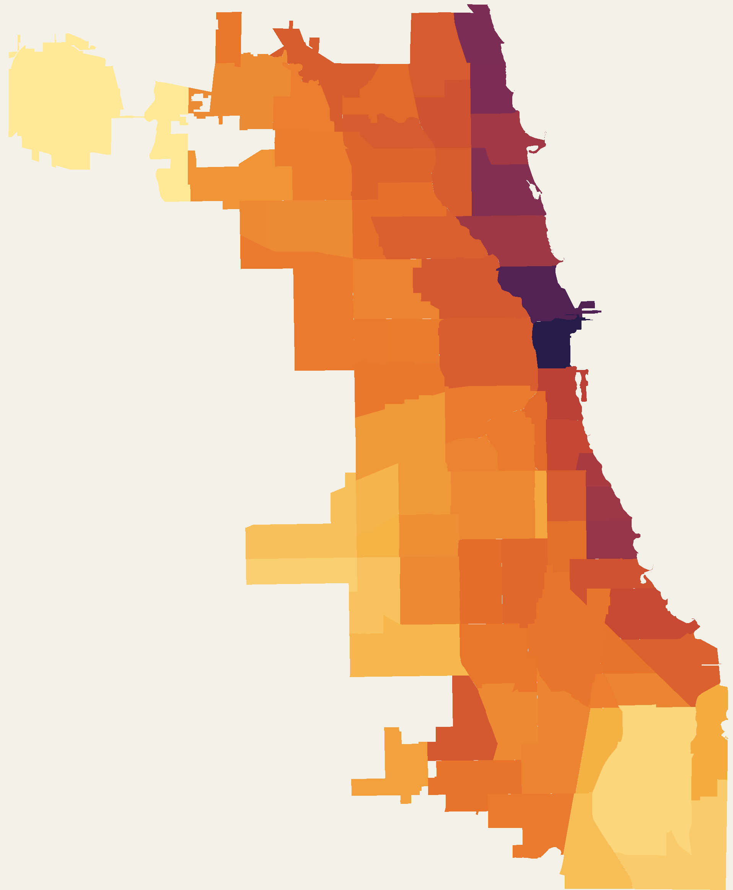
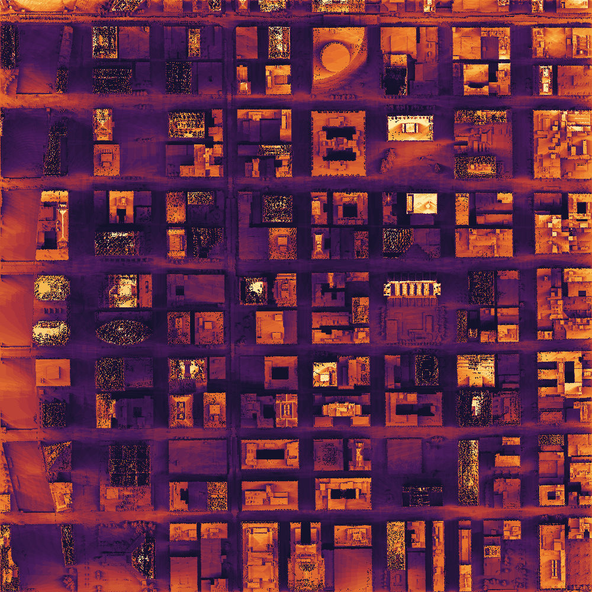

# sunscore

**Access to sunlight, by Chicago ward / community area / zip — from LiDAR.**

A standalone civic-data metric (sibling to `chainshare` and `parkability`) for
ward-wise-civic-tech / Penlight. We take a LiDAR **digital surface model** (ground +
buildings + trees), **simulate the sun** across the day and seasons, cast shadows, and
measure the share of daylight each place actually receives.



*Annual ground-level sun-access by community area — dark = shadiest (the Loop and Near
North Side, hemmed in by towers), gold = sunniest (O'Hare and the low-rise periphery).*

## Metrics (planned)

| metric | meaning | toward "sunnier" |
| --- | --- | --- |
| `summer_solstice_sun_access_pct` | share of daylight in direct sun, Jun 21 | higher |
| `winter_solstice_sun_access_pct` | share of daylight in direct sun, Dec 21 (longest shadows) | higher |
| `annual_sun_access_pct` | yearly average (21st of each month) | higher |

Published per ward, community area, and zip (ward feeds Penlight).

## How it works

- `sunscore/solar.py` — sun azimuth/altitude through each day (via `pvlib`) for the
  solstices and a monthly annual sample.
- `sunscore/shadow.py` — pure-numpy shadow casting on a DSM raster. A cell is shadowed
  if, looking toward the sun, upwind terrain rises above the sun ray leaving it. Average
  "lit" over all sun positions → a sun-access fraction per cell. This is line-of-sight
  geometry (not a radiometric model), which is exactly what "how much direct sun does
  this spot get" needs — and keeps the stack to `numpy + rasterio + pvlib`, no GRASS.

**Validated** on synthetic geometry (`tests/`): a 20 m block under a 45° southern sun
casts an exactly 20 m shadow to the north; lower sun → longer shadow; open ground gets
far more sun than a spot tucked behind a building.

Here's the raw simulation on a 1 km tile of the Loop — the street grid stays lit while the
towers throw the canyons into shade (summer, ground + rooftops):



## Status

Proof-of-concept **complete and validated on real Chicago geometry.** Ran the engine on a
1 km Loop DSM tile (2022 LiDAR, 1 m) and reproduced the expected pattern: summer rooftops
average ~47% sun-access vs ~26% at street level — the towers genuinely shadow the canyons —
and the rendered map shows the street grid lit while building blocks fall into shade.

Next: scale citywide (downsampled to ~5–10 m), mask to ground level (DSM − DTM), and run
zonal stats to the three geographies, then wire the ward rollup into Penlight.

**Data:** 2022 Cook County LiDAR DSM via the ISGS ArcGIS ImageServer `exportImage` REST API
(`sunscore/dsm.py` pulls a GeoTIFF for any bbox — no manual download). Elevations are in
feet; `load_dsm` converts to metres. The DTM (bare-earth) service alongside it gives the
ground surface for the eventual ground-level mask.

## Bring your own polygons

sunscore publishes fixed ward / community-area / ZIP rollups, but the value behind them is a per-cell
grid of direct-sun fraction on every ~18 m ground cell — so it can be re-aggregated to **any** polygons.
A run persists the grids as `data/processed/layers/sun_access_<metric>.tif`, and an aggregator (e.g.
[ward-wise / Penlight](https://penlight.wardwise.org)) can zonal-mean them over its own cells for native
per-polygon sun-access instead of an areal estimate.

```python
import json
from sunscore.aggregation import aggregate_to_polygons

cells = json.load(open("my_polygons.geojson"))             # any FeatureCollection
values = aggregate_to_polygons(cells, id_field="cell_id")  # {cell_id: {"annual_sun_access_pct": ..., ...}}
```

```bash
python -m sunscore.aggregation --polygons my_polygons.geojson --id-field cell_id
```

All three metrics are BYOP (`annual_`, `summer_solstice_`, `winter_solstice_sun_access_pct`) — the
combine is an area-weighted mean, which on the uniform grid is just the mean of the ground cells whose
centroid falls in the polygon. `aggregation.AGGREGATION_SPEC` documents this and the fine-layer files.
Verified against the 288 chiGRID cells: the Loop comes out darkest (~68% annual, towers shadowing the
canyons) and open outer cells brightest (~95%).

## Run the tests

```bash
python -m venv .venv && . .venv/bin/activate
pip install -r requirements.txt pytest
python -m pytest
```
